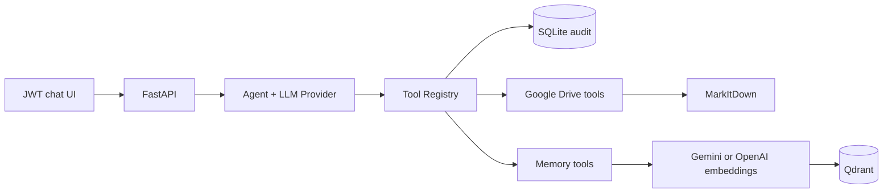

# Drive Agent

Drive Agent is a Python-based AI assistant that securely connects conversational workflows with Google Drive and long-term semantic memory. It combines provider-neutral LLM tool calling, document extraction, retrieval-augmented generation (RAG), JWT authentication, role-based access control, and auditable tool execution in a reproducible local environment.

## What it demonstrates

- A six-step Tool Registry: schema validation, authentication, scopes, rate limit, audit, and execution.
- Gemini tool calling by default, with Groq and Anthropic adapters.
- Google Drive list/download/read flow using short-lived, user-scoped artifacts.
- MarkItDown conversion for common document formats.
- Fact/preference memory and chunked document RAG memory in Qdrant.
- Persistent SQLite audit logs and role-based access control.
- Offline deterministic tests without API keys or Google credentials.

## Architecture



## Quick start

```bash
git clone <https://github.com/loanhviet/drive-agent>
cd drive-agent
python3 -m venv .venv
.venv/bin/python -m pip install -r requirements-dev.txt
cp .env.example .env
```

Set a strong `JWT_SECRET` (at least 32 characters) in `.env`, then create users locally:

```bash
.venv/bin/python -m scripts.create_user admin --role admin
.venv/bin/python -m scripts.create_user user --role user
```

For a real chat/RAG run, add a Gemini key in `.env`:

```dotenv
LLM_PROVIDER=gemini
LLM_MODEL=gemini-2.5-flash
GEMINI_API_KEY=your_key_here
GROQ_API_KEY=
EMBEDDING_PROVIDER=gemini
EMBEDDING_MODEL=gemini-embedding-001
EMBEDDING_DIM=768
```

Start the application:

```bash
.venv/bin/python -m uvicorn server:app --host 127.0.0.1 --port 9004
```

Open `http://127.0.0.1:9004`, sign in, then use the chat UI.

## Qdrant options

Development defaults to Qdrant local persistence at `.data/qdrant`; no Docker service is required.

To use Qdrant in Docker:

```bash
docker compose up --build
```

Compose overrides Qdrant connection settings for the application. For a live Drive demo, mount `credentials.json` into the container yourself and set `GOOGLE_SERVICE_ACCOUNT_FILE` to its container path; credentials are never included in this repository.

To validate the Compose file without creating a local `.env`, run:

```bash
ENV_FILE=.env.example docker compose config
```

## Demo

1. Ask to list Drive files. The agent uses `list_drive_files`.
2. Ask to read a file. The agent uses `get_drive_file`, then `read_file_tool`.
3. Say “Hãy nhớ rằng tôi thích Python”. The agent uses `save_memory`.
4. Ask “Tôi thích ngôn ngữ gì?”. The agent uses `search_memory`.
5. After reading a file, say “Lưu nội dung file lại”. The agent saves its `document_ref` as chunked RAG memory.
6. Start a new session and ask about a saved concept. The agent searches Qdrant.
7. Open Audit Log or call `GET /audit` with a JWT. Each tool call exposes all six pipeline steps.

## API

| Endpoint | Purpose |
| --- | --- |
| `POST /api/auth/login` | Exchange local username/password for a JWT. |
| `GET /api/auth/me` | Inspect the current actor. |
| `POST /api/chat` | Send an authenticated chat message. |
| `POST /api/clear` | Clear an authenticated conversation history. |
| `GET /audit` | Get persistent tool audit logs. |
| `GET /api/health` | Health check without external-service calls. |

Admin has Drive read plus memory read/write. User has Drive read and memory read only. Audit logs are scoped to the requesting user unless the requester is an admin.

## Configuration

Copy `.env.example`; do not commit `.env`.

| Group | Important variables |
| --- | --- |
| App | `APP_DB_PATH`, `JWT_SECRET`, `JWT_EXPIRE_MINUTES` |
| LLM | `LLM_PROVIDER`, `LLM_MODEL`, `GEMINI_API_KEY`, `GROQ_API_KEY`, `ANTHROPIC_API_KEY` |
| Embedding | `EMBEDDING_PROVIDER`, `EMBEDDING_MODEL`, `EMBEDDING_DIM`, `OPENAI_API_KEY` |
| Qdrant | `QDRANT_MODE`, `QDRANT_PATH`, `QDRANT_URL`, `QDRANT_HOST`, `QDRANT_PORT` |
| Drive | `GOOGLE_SERVICE_ACCOUNT_FILE`, `GOOGLE_DRIVE_FOLDER_ID` |

## Quality checks

```bash
.venv/bin/python -m pytest
.venv/bin/ruff check .
.venv/bin/pre-commit install
```

The default test suite is offline. It uses fake LLM/embedding providers, fake Google Drive service objects, temporary SQLite databases, and local Qdrant paths. Live Gemini, Anthropic, Google Drive, and remote Qdrant runs are intentionally not faked: configure real credentials to test them.

## Security and trade-offs

- JWTs are stored in `sessionStorage` because this is a local learning/demo UI; production should use a stronger browser-session strategy.
- Audit logs redact sensitive argument keys and truncate long strings.
- Downloaded Drive files are temporary, user-scoped, and deleted after reading or expiry.
- Qdrant collections include the embedding provider/model/dimension in their name to prevent vector-space mixing.
- No API key, service account, vector data, local database, cache, or virtual environment is tracked by Git.
