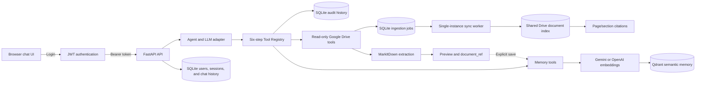

# Drive Agent

Drive Agent is a portfolio and learning project that connects an LLM-based agent to Google Drive and user-scoped semantic memory. It demonstrates a working end-to-end flow without presenting the project as a production-ready service.

The project is under active development, with ongoing work focused on reliability, tests, documentation, and the demo workflow.

**Core flow:** JWT-authenticated request -> agent and tool selection -> guarded tool execution -> shared Drive retrieval or personal semantic memory -> cited streamed response -> persistent chat and audit history.

## Key features

- FastAPI backend with a browser chat UI and SSE progress streaming.
- Qwen as the default LLM provider, with Gemini, Groq, and Anthropic adapters.
- A six-step Tool Registry: schema validation, authentication, scope checks, rate limiting, pre-execution audit logging, and tool execution.
- Read-only Google Drive listing, recursive folder discovery, download, and document reading.
- Durable SQLite ingestion jobs with manual and scheduled incremental sync.
- A shared Qdrant document corpus with revision activation, removal, and page/section citations.
- A Documents panel for sync status, indexed-file health, and safe links back to Drive.
- MarkItDown extraction with a bounded preview and temporary `document_ref` for full-document ingestion.
- User-scoped fact and document memory in Qdrant using dense-vector retrieval, with list, update, and delete tools.
- Request correlation via `X-Request-ID` on every API response.
- SQLite persistence for users, chat sessions, completed messages, and audit records.
- Audit argument redaction and separate role scopes for Drive and memory access.
- Offline deterministic tests, Ruff checks, and an 85% CI coverage threshold.
- Docker Compose support with persistent SQLite and Qdrant volumes.

## Demo

https://github.com/user-attachments/assets/f60a6840-1178-4070-834f-ed7e33fe7bbe

The demo follows this workflow:

```text
Login -> List Drive files -> Read a document -> Save semantic memory
      -> Retrieve it in another session -> Inspect the audit log
```

## Architecture



Most requests use the configured LLM for tool selection. Explicit Drive-list requests use a deterministic shortcut for reliability, while still passing through the Tool Registry.

## Current limitations

- This is a single-process demo, not a production-ready service.
- Agent instances, short-lived artifact/document caches, and rate-limit buckets are held in process memory; ingestion jobs are durable.
- `/api/health` only checks the web process; use `/api/ready` for dependency checks. Neither calls paid LLM providers.
- Retrieval is dense-vector search only.
- An eval runner is included, but a reviewed project-specific dataset must be created before its metrics are release evidence.
- Shared-document retrieval is dense-vector search only; there is no hybrid search or reranking.
- Google Drive access is read-only.
- There is no write workflow or human-approval flow.
- Real provider calls require separately configured credentials.
- JWTs are stored in `sessionStorage` as a demo trade-off.

## Quick start

Requirements:

- Python 3.12 or later.
- Google service-account credentials for the Drive files used in the demo.
- Credentials for the selected LLM and embedding providers.

```bash
git clone https://github.com/loanhviet/drive-agent.git
cd drive-agent

python3 -m venv .venv
.venv/bin/python -m pip install -r requirements-dev.txt
cp .env.example .env
```

Configure the default Qwen LLM and Gemini embeddings in `.env`:

```dotenv
JWT_SECRET=replace-with-at-least-32-characters
DASHSCOPE_API_KEY=your_key
DASHSCOPE_BASE_URL=your_openai_compatible_base_url
GEMINI_API_KEY=your_key
GOOGLE_SERVICE_ACCOUNT_FILE=credentials.json
GOOGLE_DRIVE_FOLDER_ID=your_shared_folder_id
DRIVE_SYNC_INTERVAL_SECONDS=900
```

Create local users and start the application:

```bash
.venv/bin/python -m scripts.create_user admin --role admin
.venv/bin/python -m scripts.create_user user --role user
.venv/bin/python -m uvicorn server:app --host 127.0.0.1 --port 9004
```

Open `http://127.0.0.1:9004` and log in with a user you created. Admin users can open **Documents** to start an incremental or full sync. When `GOOGLE_DRIVE_FOLDER_ID` is configured, the single-instance worker also schedules an incremental sync every 15 minutes by default.

Personal memory uses embedded persistence at `.data/qdrant`; the shared Drive corpus uses `.data/qdrant_drive` so both local clients can coexist. To run the application and Qdrant with persistent Docker volumes instead:

```bash
docker compose up --build
```

`docker compose down` preserves the `app_data` and `qdrant_data` volumes; `docker compose down -v` removes them.

The default models are Qwen `qwen3.6-flash` for chat and Gemini `gemini-embedding-001` with 768 dimensions for embeddings. Qdrant collection names include the embedding provider, model, and dimension to avoid mixing incompatible vector spaces.

## Tests and quality checks

The default suite runs offline with fake LLM, embedding, Drive, and vector-store components.

```bash
.venv/bin/python -m pytest -q
.venv/bin/ruff check .
.venv/bin/pre-commit run --all-files
```

CI runs Ruff and pytest coverage across the agent, registry, services, tools, and server modules. The coverage job fails below 85%.

For retrieval evaluation, copy `eval/shared_drive_cases.example.jsonl` to a private or sanitized reviewed dataset and run:

```bash
.venv/bin/python -m scripts.eval_shared_drive eval/shared_drive_cases.jsonl \\
  --json-output artifacts/shared-drive-eval.json \\
  --markdown-output artifacts/shared-drive-eval.md
```

The runner reports source/locator Recall@K, evidence-term recall, MRR, abstention, and failing cases. Generated `artifacts/` are ignored to reduce the risk of committing private document evidence.

> This repository is a portfolio and learning project. It has not been reviewed or validated for production, regulated, or sensitive-data use.
